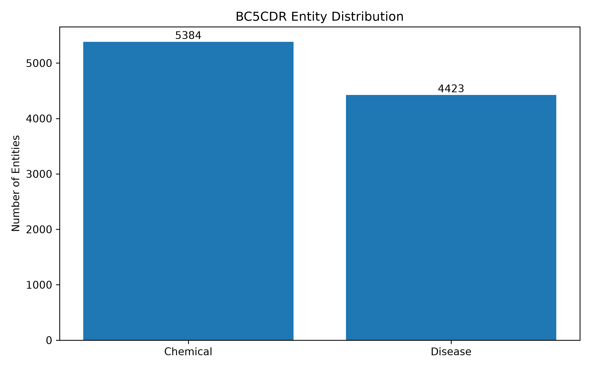
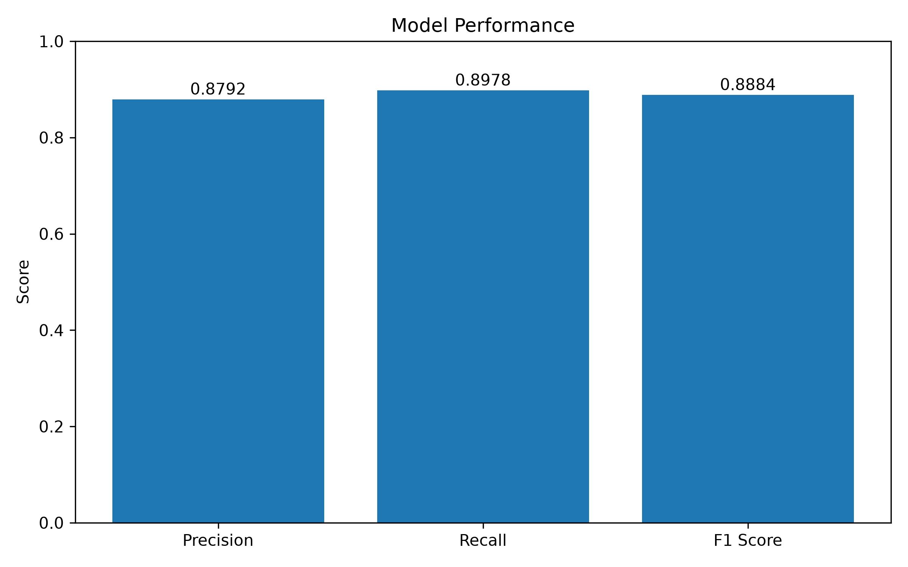
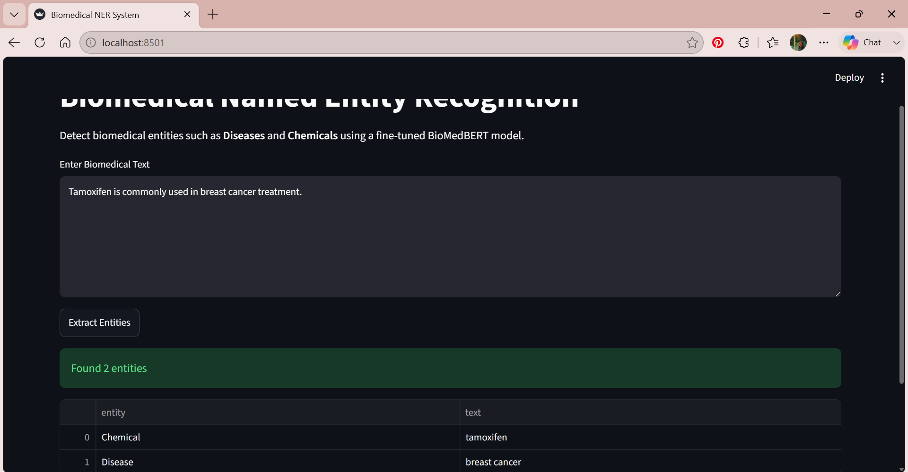
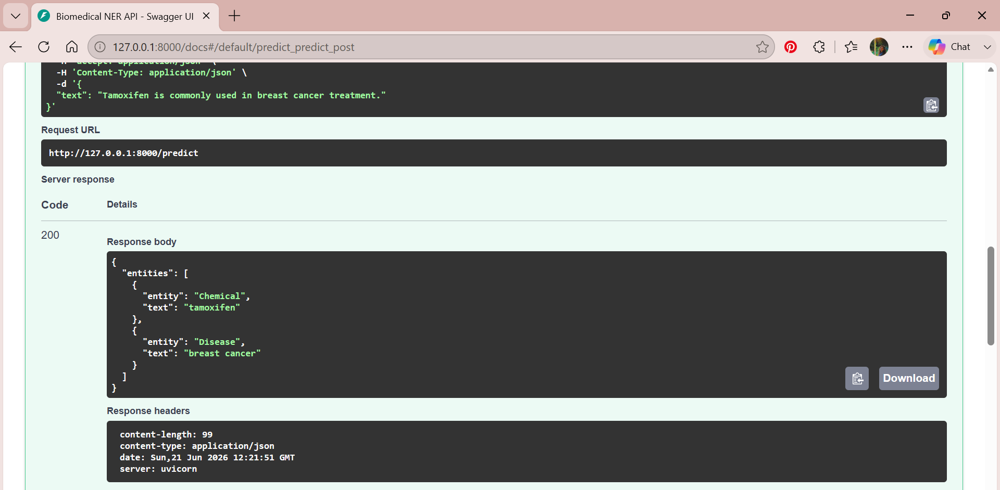

# Biomedical Named Entity Recognition using BioMedBERT

A Biomedical Named Entity Recognition (NER) system built using a fine-tuned BioMedBERT model on the BC5CDR dataset for identifying **Diseases** and **Chemicals** from biomedical text.

The project includes:

- Fine-tuned BioMedBERT model
- Inference pipeline
- Streamlit Web Application
- FastAPI REST API
- Model Evaluation
- Visualization Dashboard
- Sample Predictions

---

## Project Overview

Named Entity Recognition (NER) is a key Natural Language Processing (NLP) task that identifies and classifies important entities within text.

This project focuses on the biomedical domain, where accurate extraction of diseases and chemicals can support:

- Clinical decision support systems
- Biomedical literature mining
- Drug discovery
- Medical information retrieval
- Healthcare NLP applications

The model is trained using the BC5CDR benchmark dataset and fine-tuned from BioMedBERT.

---

## Dataset

### BC5CDR Dataset

BC5CDR contains manually annotated biomedical abstracts with two entity types:

| Entity Type | Description                     |
| ----------- | ------------------------------- |
| Chemical    | Drugs, compounds, chemicals     |
| Disease     | Diseases and medical conditions |

### Dataset Statistics

| Entity         | Count |
| -------------- | ----- |
| Chemical       | 5384  |
| Disease        | 4423  |
| Total Entities | 9807  |

---

## Model

### Base Model

**BioMedBERT**

Model:

```text
microsoft/BiomedNLP-BiomedBERT-base-uncased-abstract-fulltext
```

### Architecture

```text
Input Text
    ↓
Tokenizer
    ↓
BioMedBERT Encoder
    ↓
Token Classification Head
    ↓
BIO Entity Tags
    ↓
Entity Reconstruction
```

### Entity Labels

```text
B-Chemical
I-Chemical

B-Disease
I-Disease

O
```

---

## Project Structure

```text
Biomedical-NER-System
│
├── api
│   └── main.py
│
├── app
│   ├── app.py
│   └── test_inference.py
│
├── data
│   └── bc5cdr
│       ├── train.json
│       ├── valid.json
│       ├── test.json
│       └── label.json
│
├── model
│   └── best_model
│       ├── config.json
│       ├── model.safetensors
│       ├── tokenizer.json
│       └── tokenizer_config.json
│
├── notebooks
│   └── 01_training.ipynb
│
├── outputs
│   ├── figures
│   │   ├── entity_distribution.png
│   │   ├── performance_metrics.png
│   │   ├── streamlit_ui.png
│   │   └── fastapi_swagger.png
│   │
│   ├── predictions
│   │   └── sample_predictions.json
│   │
│   └── reports
│       └── classification_report.txt
│
├── src
│   ├── evaluate.py
│   ├── generate_predictions.py
│   ├── inference.py
│   ├── train.py
│   ├── utils.py
│   └── visualize.py
│
├── requirements.txt
├── .gitignore
└── README.md
```

---

## Installation

### Clone Repository

```bash
git clone https://github.com/your-username/Biomedical-NER-System.git

cd Biomedical-NER-System
```

### Create Virtual Environment

```bash
python -m venv venv
```

### Activate Environment

Windows:

```bash
venv\Scripts\activate
```

Linux/Mac:

```bash
source venv/bin/activate
```

### Install Dependencies

```bash
pip install -r requirements.txt
```

---

## Model Evaluation

### Overall Performance

| Metric    | Score  |
| --------- | ------ |
| Precision | 0.8792 |
| Recall    | 0.8978 |
| F1 Score  | 0.8884 |

### Per-Class Performance

| Entity   | Precision | Recall | F1 Score |
| -------- | --------- | ------ | -------- |
| Chemical | 0.9355    | 0.9186 | 0.9270   |
| Disease  | 0.8162    | 0.8725 | 0.8434   |

---

## Visualizations

### Entity Distribution



### Model Performance



---

## Sample Prediction

Input:

```text
Tamoxifen is commonly used in breast cancer treatment.
```

Output:

```json
[
  {
    "entity": "Chemical",
    "text": "tamoxifen"
  },
  {
    "entity": "Disease",
    "text": "breast cancer"
  }
]
```

---

# Streamlit Application

The project includes a Streamlit-based web application for interactive biomedical entity extraction.

### Run Streamlit

```bash
streamlit run app/app.py
```

### Features

- User-friendly interface
- Real-time entity extraction
- Tabular entity display
- Local inference using BioMedBERT

### Streamlit UI



---

# FastAPI REST API

The project also provides a REST API built with FastAPI.

### Run API

```bash
uvicorn api.main:app --reload
```

### API Documentation

```text
http://127.0.0.1:8000/docs
```

### Example Request

```json
{
  "text": "The patient was diagnosed with typhoid and prescribed paracetamol."
}
```

### Example Response

```json
{
  "entities": [
    {
      "entity": "Disease",
      "text": "typhoid"
    },
    {
      "entity": "Chemical",
      "text": "paracetamol"
    }
  ]
}
```

### Swagger UI



---

## Running Evaluation

```bash
python -m src.evaluate
```

Outputs:

```text
outputs/reports/classification_report.txt
```

---

## Generating Sample Predictions

```bash
python -m src.generate_predictions
```

Outputs:

```text
outputs/predictions/sample_predictions.json
```

---

## Technologies Used

- Python
- PyTorch
- Hugging Face Transformers
- BioMedBERT
- BC5CDR Dataset
- FastAPI
- Streamlit
- SeqEval
- Matplotlib
- Pandas

---

## Future Improvements

- Support additional biomedical entities
- Integration with PubMed articles
- Entity linking and normalization
- Clinical note processing
- Biomedical relation extraction
- Docker deployment
- Cloud deployment

---

## Author

**Ananya Upadhyay**

M.Tech CSE, LNMIIT Jaipur

Interests:

- Artificial Intelligence
- Machine Learning
- Natural Language Processing
- Biomedical NLP
- Healthcare AI

---

## License

This project is developed for academic and research purposes.
